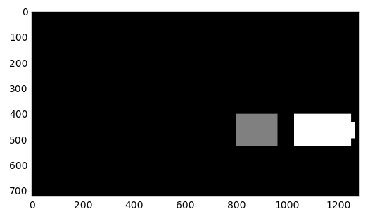

# Vehicle Detection Project

The goals / steps of this project are the following:

* Perform a Histogram of Oriented Gradients (HOG) feature extraction on a labeled training set of images and train a classifier Linear SVM classifier
* Optionally, you can also apply a color transform and append binned color features, as well as histograms of color, to your HOG feature vector.
* Note: for those first two steps don't forget to normalize your features and randomize a selection for training and testing.
* Implement a sliding-window technique and use your trained classifier to search for vehicles in images.
* Run your pipeline on a video stream (start with the test_video.mp4 and later implement on full project_video.mp4) and create a heat map of recurring detections frame by frame to reject outliers and follow detected vehicles.
* Estimate a bounding box for vehicles detected.

## Image References


[project_video.mp4](./project_video.mp4)

## Rubric Points
Here I will consider the rubric points individually and describe how I addressed each point in my implementation.
- [Rubric Points](https://review.udacity.com/#!/rubrics/513/view)

---
## Writeup

### Histogram of Oriented Gradients (HOG)

#### 1. Explain how (and identify where in your code) you extracted HOG features from the training images.

The code for this step is contained in the third code cell of the IPython notebook (CarND-Vehicle-Detection.ipynb)
The function name is `get_hog_features`.

I started by reading in all the `vehicle` and `non-vehicle` images.  Here is an example of one of each of the `vehicle` and `non-vehicle` classes:


I then explored different color spaces and different `skimage.hog()` parameters (`orientations`, `pixels_per_cell`, and `cells_per_block`).  I grabbed random images from each of the two classes and displayed them to get a feel for what the `skimage.hog()` output looks like.

Here is an example using the `LUV` color space and HOG parameters of `orientations=12`, `pixels_per_cell=(8, 8)`, `cells_per_block=(1, 1)` and `transform_sqrt=False` using all three color channel:


### 2. Explain how you settled on your final choice of HOG parameters.

I tried various combinations of parameters on training a linear SVM.

- color space: RGB, HSV, LUV, HLS, YUV and YCrCb
- color channel: 0, 1, 2 and ALL
- cell per block: 1 and 2

As a result, I got the final choice with the best accuracy `0.9854` on testing dataset.

- color space: LUV
- color channel: ALL
cell per block: 1

#### 3. Describe how (and identify where in your code) you trained a classifier using your selected HOG features (and color features if you used them).

I trained a linear SVM using all of bin spatial, color histogram and HOG features with the following steps:

1. Extract bin spatial, color histogram and HOG features and then concatenate them.
2. Find the best penalty parameter C of the error term `C` with the extracted features by grid-search.

where the number of cross-validation splits was 5, the metrics was accuracy.

```
tuned_parameters = [
  {'kernel': ['linear'], 'C': [0.1, 1.0, 5.0]}
]
clf = GridSearchCV(SVC(), tuned_parameters, cv=5, scoring='accuracy', n_jobs=4, verbose=1)
clf.fit(X_train, y_train)
```

The function to extract features is `single_img_features`.
It allows us to concatenate bin spatial, color histogram and HOG features based on the flags to include features which we want.

### Sliding Window Search

#### 1. Describe how (and identify where in your code) you implemented a sliding window search.  How did you decide what scales to search and how much to overlap windows?

I implemented two type of functions for a sliding window search.
One is `search_windows`.
The other is `find_cars`.

Firstly, `search_windows` has steps:

1. Convert a given RGB image to another color space, such as `HLS` and `LUV`.
2. Compute spatial features if the flag is set.
3. Compute histogram features if the flag is set.
4. Compute HOG features if the flag is set.
5. Concatenate the computed features.

As we learned that in the lecture, it is not efficient in terms of computing cost, because the function has a bunch of overwrap calculation on HOG features.

That's why I implemented another one: `find_cars`.
In this function, we compute HOG features of a whole image at one time and then slide windows over a given image.
The function allows us to control the area of a image to compute features.
As well as, we can control the window size with the parameter: `scale`.


#### 2. Show some examples of test images to demonstrate how your pipeline is working.  What did you do to optimize the performance of your classifier?

Ultimately I searched on three scales using LUV 3-channel HOG features plus spatially binned color and histograms of color in the feature vector, which provided a nice result.
Here are some example images:


---

### Video Implementation

#### 1. Provide a link to your final video output.

Here is the final result of the pipeline.
The video is composed of three parts.

1. Top video: The final result of the pipeline. It include the final bounding boxex to detect cars.
2. Bottom left video: The intermediate result drawn bounding boxes of multiple detections.
3. Bottom right video: The intermediate result drawn heatmap of multiple detections.

[project_video.output.mp4](./project_video.output.mp4)


#### 2. Describe how (and identify where in your code) you implemented some kind of filter for false positives and some method for combining overlapping bounding boxes.

I recorded the positions of positive detections in each frame of the video.
From the positive detections I created a heatmap and then thresholded that map to identify vehicle positions.
I then used `scipy.ndimage.measurements.label()` to identify individual blobs in the heatmap.
I then assumed each blob corresponded to a vehicle.
I constructed bounding boxes to cover the area of each blob detected.

1. Get bounding boxes with multiple scales: 1.0, 1.5, 2.0.
2. Counting overwrap detections as heatmap
3. Apply a threshold to the heatmap to filter "hot" parts.
4. Figure out how many cars in each frame with `scipy.ndimage.measurements.labels`.

Here's an example result showing the heatmap from a series of frames of video, the result of `scipy.ndimage.measurements.label()` and the bounding boxes then overlaid on the last frame of video:



---

### Discussion

#### Need a better way to remove false positive

According to the bottom-left image of the below image, the classification could detect a car.
However, the filtering process whose threshold is 1 dropped the detection.

One of the causes is that a car should be detected with multiple detection.
By doing that, heatmap could be activate.
So, I think there are two major approach to solve the issue.

1. Modify a way to slide windows.
2. Improve classification with more images.


